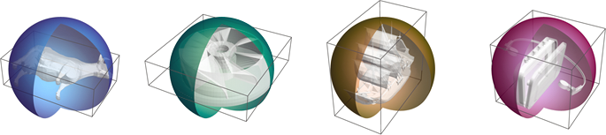

## bsphere.h



A C libary to compute N-dimensional approximate bounding spheres using an 
iterative version of Ritter's algorithm.

- Single header file with no dependencies.
- Compiles as C or C++.
- Uses a stride so vertex buffers can be passed in unmodified.
- Works in N > 0 dimensions.
- Public domain.

### How to Use

The implementation is a single, self-contained C function which can be pasted
into your own code and customized as required.

If you prefer to use `bsphere.h`, simply include it. It follows the same 
convention as the excellent [STB libraries](https://github.com/nothings/stb)
in that the `BSPHERE_IMPLEMENTATION` symbol must be defined to turn on function
implementations. Typical usage would therefore consist of something like this
at the bottom of *one* C or C++ file in your project:

	#define BSPHERE_IMPLEMENTATION
	#include "bsphere.h"

### API

```
bounding_sphere()

Computes a bounding sphere for a list of points. The result is approximate in
the sense that it may not be the smallest possible bounding sphere, but not 
in the sense that it may not bound the points; it always will.

The procedure used is the iterative variant of [1] described in [2].

The input is an array of vertices, each beginning with a vector of 'ndim'
floats. The 'bytes_per_vertex' parameter gives the size of each vertex. 
Vertices may be larger than the vectors they contain, allowing typical 
polymesh vertex buffers to be passed directly to the function.

For portable behaviour the caller should ensure that 'bytes_per_vertex' is
a multiple of sizeof(float) and that the input array is likewise aligned. The
code will generate unaligned loads if these conditions are not met, which do
not work on all platforms (e.g. many ARM CPUs).

[1] Ritter, J. An efficient bounding sphere. In Andrew S. Glassner, editor, 
    Graphics Gems. Academic Press, Boston, MA, 1990.
[2] Ericson, C. Real-Time Collision Detection. Morgan Kaufmann, 2004.

RETURN VALUE

    The radius of the bounding sphere.

PARAMETERS

    out_center       - Location to write the center point of the sphere.
    vertices         - An array of vertices, each beginning with an N-d vector.
    num_vertices     - Number of entries in the vertex array.
    bytes_per_vertex - A stride in bytes used to access the vertex array.
    ndim             - Number of components in the vector to read from each 
                       vertex.
    indices          - Optional array of 'num_vertices' indices into the 
                       input array. The indices are vertex numbers, not byte 
                       offsets. Useful for processing a subset of a larger
                       vertex array.
    num_iterations   - Number of times to repeat the expansion phase in an 
                       attempt to improve the solution. For typical inputs 
                       there is usually little benefit in more than 4 or 8 
                       iterations.
```
